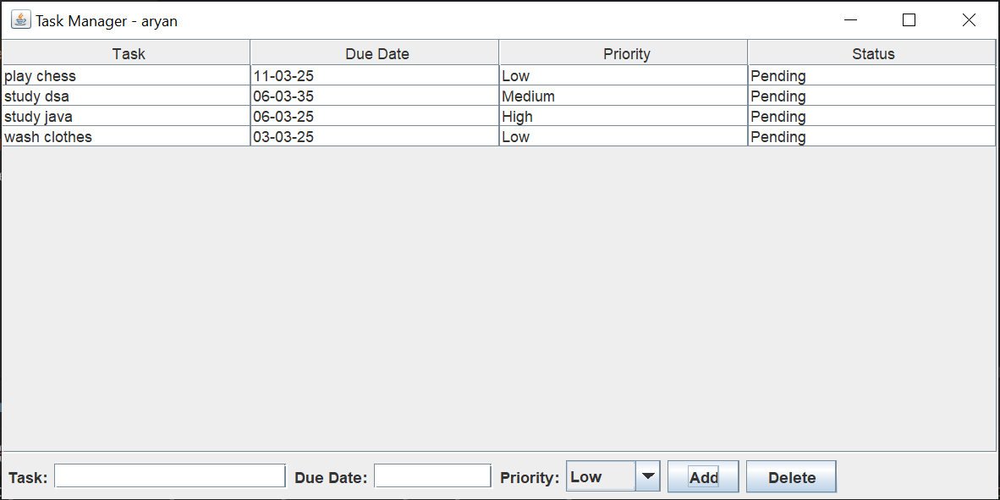
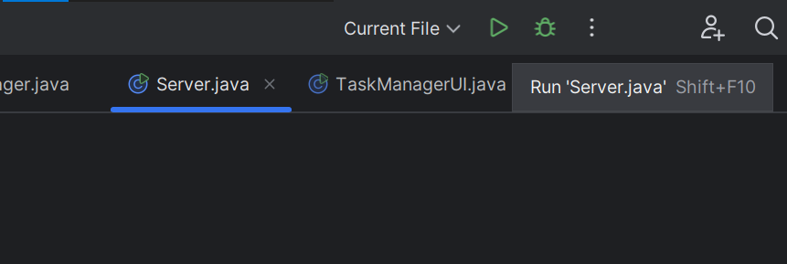
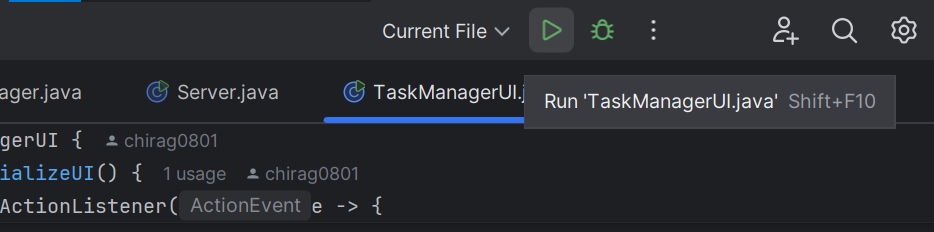

# Task Manager Application


A Java-based task manager with MySQL integration, allowing users to add, delete, and organize tasks with priorities.



## Table of Contents
- [Features](#features)
- [Prerequisites](#prerequisites)
- [IntelliJ Setup](#intellij-setup)
- [Database Configuration](#database-configuration)
- [Running the Application](#running-the-application)
- [Usage](#usage)
- [Troubleshooting](#troubleshooting)

## Features
- Add/delete tasks with due dates and priorities
- MySQL database persistence
- User-specific task lists
- Real-time UI updates

## Prerequisites
- **Java JDK 21+**: [Download](https://adoptium.net/)
- **MySQL 8.0+**: [Download](https://dev.mysql.com/downloads/mysql/)
- **IntelliJ IDEA**: [Download](https://www.jetbrains.com/idea/)
- **Maven Plugin**: Bundled with IntelliJ

---

## IntelliJ Setup

### 1. Import Project
1. Open IntelliJ IDEA
2. **File > Open** > Select the project folder
3. Choose **"Open as Project"**

### 2. Configure JDK
1. **File > Project Structure**
2. Under **Project SDK**, add JDK 21+ if not detected

### 3. Maven Setup
1. Enable auto-import:  
   **View > Tool Windows > Maven** > Enable **"Import Maven Projects Automatically"**
2. Refresh dependencies:  
   Click the **Maven Reload** icon (⟳) in the Maven toolbar

---

## Database Configuration

### 1. MySQL Setup
```sql
CREATE DATABASE task_db;
USE task_db;

CREATE TABLE tasks (
    user VARCHAR(255) NOT NULL,
    task VARCHAR(255) NOT NULL,
    due_date VARCHAR(255),
    priority VARCHAR(255),
    status VARCHAR(255),
    PRIMARY KEY (user, task)
);
```

### 2. Update Credentials
Edit `src/database/DatabaseManager.java`:
```java
private static final String USER = "root";          // Your MySQL username
private static final String PASS = "your_password"; // Your MySQL password
```

---

## Running the Application

### 1. Server Setup
1. **Right-click `src/server/Server.java** 
2. **Run 'Server.main()'**
   

### 2. Client Setup
1. **Right-click `src/ui/TaskManagerUI.java** 
2. **Run 'TaskManagerUI.main()'**
   

---

## Usage
1. Enter your username when the client launches
2. **Add Task**:
   - Fill in Task/Due Date
   - Select priority
   - Click **Add**
3. **Delete Task**:
   - Select task in table
   - Click **Delete**


---

## Troubleshooting (IntelliJ Specific)

| Issue | Solution |
|-------|----------|
| "JDK not valid" error | Configure Project SDK in **File > Project Structure** |
| Maven dependencies missing | Click **Maven Reload** (⟳) in Maven toolbar |
| ClassNotFoundException | Rebuild project: **Build > Rebuild Project** |
| MySQL connection refused | Verify credentials in `DatabaseManager.java` |

---

## Project Structure
```
TaskManager/
├── src/
│   ├── client/          # Client networking
│   ├── server/          # Server logic
│   ├── database/        # MySQL handler
│   └── ui/              # Swing GUI
├── pom.xml              # Maven config
└── README.md            # This guide
```

---

**IntelliJ Support**: Use the built-in terminal (**Alt+F12**) for Git/Maven commands.
