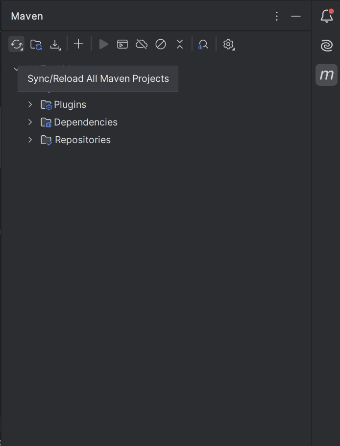

# Task Manager Application


A Java Swing application with MySQL backend for managing tasks. Supports adding/deleting tasks with priorities.

## Table of Contents
- [Clone from GitHub](#clone-from-github)
- [IntelliJ Setup](#intellij-setup)
- [Database Configuration](#database-configuration)
- [Run the Application](#run-the-application)
- [Usage](#usage)
- [Troubleshooting](#troubleshooting)
- [Project Structure](#project-structure)

---

## Clone from GitHub

### Method 1: Using IntelliJ
1. Open IntelliJ IDEA
2. **File > New > Project from Version Control...**
3. Paste URL: `https://github.com/ChiragP-8/TaskManager.git`
4. Click **Clone**  
   

### Method 2: Using Terminal
```bash
git clone https://github.com/ChiragP-8/TaskManager.git
cd TaskManager
```

---

## IntelliJ Setup

### 1. Configure Project
1. **File > Open** > Select cloned folder
2. Enable Maven auto-import:  
   **View > Tool Windows > Maven** > Click **⟳ Reload**  
   

### 2. Set Up JDK
1. **File > Project Structure** (Ctrl+Alt+Shift+S)
2. Under **Project SDK**:  
   - Add JDK 21+ if missing  
   - Set language level to 17  
   

---

## Database Configuration

### 1. MySQL Setup
1. Start MySQL Server
2. Run these commands:
```sql
CREATE DATABASE task_db;
USE task_db;

CREATE TABLE tasks (
    user VARCHAR(255) NOT NULL,
    task VARCHAR(255) NOT NULL,
    due_date VARCHAR(255),
    priority VARCHAR(255),
    status VARCHAR(255),
    PRIMARY KEY (user, task)
);
```

### 2. Update Credentials
Edit `src/database/DatabaseManager.java`:
```java
private static final String USER = "root";          // Your MySQL username
private static final String PASS = "your_password"; // MySQL password
```

---

## Run the Application

### 1. Start Server
1. Navigate to `src/server/Server.java`
2. Right-click > **Run 'Server.main()'**  
   

### 2. Start Client
1. Navigate to `src/ui/TaskManagerUI.java`
2. Right-click > **Run 'TaskManagerUI.main()'**  
   

---

## Usage
1. **Add Task**:  
   - Enter Task/Due Date  
   - Select Priority  
   - Click **Add**  
   

2. **Delete Task**:  
   - Select task in table  
   - Click **Delete**  
   

---

## Troubleshooting

| Issue | Solution |
|-------|----------|
| `java.sql.SQLException: Access denied` | Verify credentials in `DatabaseManager.java` |
| `ClassNotFoundException` | 1. Maven Reload<br>2. **Build > Rebuild Project** |
| Server not starting | Check MySQL is running on port 3306 |
| GUI not updating | Run server before client |

---

## Project Structure
```
TaskManager/
├── src/
│   ├── client/          # Client networking (TCP)
│   ├── server/          # Server and DB handler
│   ├── database/        # MySQL connection logic
│   └── ui/              # Swing GUI components
├── pom.xml              # Maven dependencies
├── README.md            # This documentation
└── screenshots/         # Demo images
```

---

**Report Issues**: [GitHub Issues](https://github.com/ChiragP-8/TaskManager/issues)

---

**Note for Developers**:  
- Use **Alt+F12** for IntelliJ's built-in terminal  
- Server logs appear in the **Run** window  
- Client and server must run simultaneously
